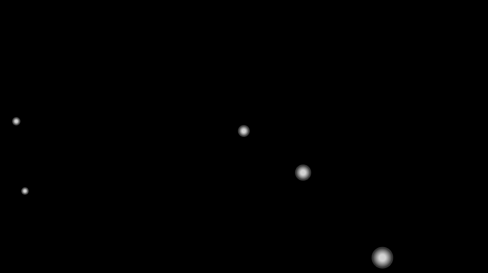

# Bubble Consumption
Bubbles represent NFTs. When the simulation starts up, NFTs are minted and bubbles are constructed.
Test wallets will also be created. 

Bubbles will start off in a light grey state and will be assigned a random colour when they have been transferred to a test wallet.

When bubbles collide, there is a 5% chance that the larger bubble will pop the smaller one. When this happens the larger bubble "purchases" the smaller bubble's NFT. So the larger bubble transfers SOL to the smaller bubble's owner, and in return the smaller bubble transfers its NFT to the larger bubble's owner.
